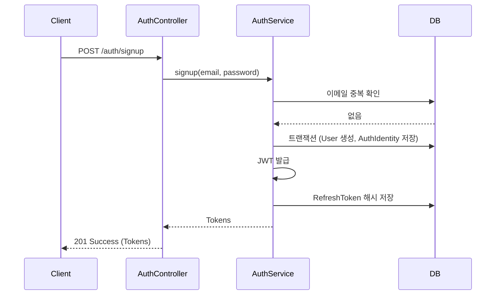
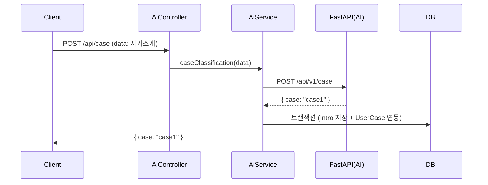
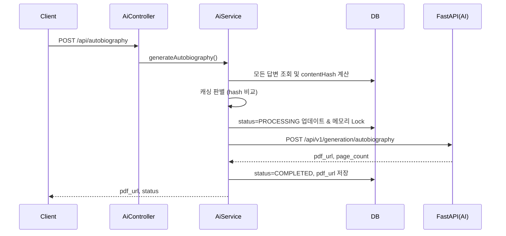
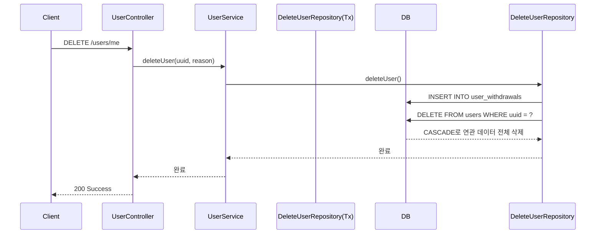

# Backend 주요 비즈니스 흐름 명세서

본 문서는 NestJS 백엔드(`ai-life-legacy-backend-nestjs`)의 핵심 비즈니스 로직 및 처리 흐름을 분석한 문서입니다. 시스템 흐름 파악 및 시퀀스 다이어그램 작성에 활용할 수 있습니다.

---

## 1. 회원가입 흐름 (Signup)
- **Start API**: `POST /auth/signup`
- **Controller**: `AuthController`
- **Service/Repository**: `AuthService`, `AuthIdentityRepository`, `CreateUserRepository`
- **DB 처리**:
  - `auth_identities` 테이블에서 이메일 중복 검사.
  - 트랜잭션(`CreateUserRepository`)을 통해 `users` 엔티티 생성 및 `auth_identities`에 해싱된 비밀번호 저장.
  - `refresh_tokens` 테이블에 리프레시 토큰 해시 저장.
- **AI 서버 호출**: 없음.
- **성공 응답**: `201 Created` / AccessToken, RefreshToken 반환
- **실패 처리**: 409 Email already exists.

---

## 2. 로그인 흐름 (Login)
- **Start API**: `POST /auth/login`
- **Controller**: `AuthController`
- **Service/Repository**: `AuthService`, `AuthIdentityRepository`, `RefreshTokenRepository`
- **DB 처리**:
  - `auth_identities`에서 이메일로 유저 조회.
  - `bcrypt.compare`로 비밀번호 확인.
  - 발급된 RefreshToken 해시를 `refresh_tokens` 테이블에 업데이트(또는 새로 저장).
- **AI 서버 호출**: 없음.
- **성공 응답**: `200 OK` / AccessToken, RefreshToken 반환
- **실패 처리**: 404 User not found, 401 Invalid credentials.

---

## 3. 자기소개 저장 흐름 (Save Intro)
- **Start API**: `POST /users/me/intro`
- **Controller**: `UserController`
- **Service/Repository**: `UserService`, `UserIntroRepository`
- **DB 처리**:
  - 기존 작성된 `UserIntro`가 있는지 확인.
  - 없으면 `user_intros` 테이블에 자기소개 텍스트 저장.
- **AI 서버 호출**: 없음. (AI 분석은 `/api/case`에서 수행됨)
- **성공 응답**: `201 Created`

---

## 4. case 분류 요청 흐름 (Case Classification)
- **Start API**: `POST /api/case`
- **Controller**: `AiController`
- **Service/Repository**: `AiService`, `SaveUserIntroductionRepository`
- **DB 처리**:
  - AI 응답으로 온 `userCase`(예: case1)와 입력받은 소개글을 `saveUserTransactionRepository` 트랜잭션을 통해 `users.user_case_id` 매핑 및 `user_intros`에 함께 저장.
- **AI 서버 호출**: `POST http://localhost:8000/api/v1/case`
- **성공 응답**: AI가 판단한 `case` 식별자 반환 (`CaseResponseDTO`)
- **실패 처리**: 500 AI Server Error.

---

## 5. 목차/질문 조회 흐름 (TOC/Questions Fetch)
- **Start API**: `GET /life-legacy/toc/:tocId/questions` (단일 챕터용)
- **Controller**: `LifeLegacyController`
- **Service/Repository**: `LifeLegacyService`, `LifeLegacyQuestionRepository`, `LifeLegacyRepository`
- **DB 처리**:
  - `tocId`에 해당하는 전체 `questions` 조회.
  - 해당 유저가 이미 작성한 `life_legacy_answers` 조회.
  - 교집합을 제외한 '답변하지 않은 질문'만 필터링하여 반환.
- **AI 서버 호출**: 없음.
- **성공 응답**: `QuestionResponseDTO[]`

---

## 6. 답변 저장/수정 흐름 (Answer Save/Update)
- **Start API**: `POST /life-legacy/toc/:tocId/questions/:questionId/answers`
- **Controller**: `LifeLegacyController`
- **Service/Repository**: `LifeLegacyService`, `LifeLegacyRepository`
- **DB 처리**:
  - `userUuid`와 `questionId`로 기존 답변 확인 (`findOneUserAnswerByUuidAndQuestionId`).
  - 존재 시 Update, 없으면 Insert 수행 (`saveUserAnswer`).
- **AI 서버 호출**: 없음.
- **성공 응답**: `200 OK` (Result 필드 없음)

---

## 7. 자서전 생성 흐름 (Autobiography Generation)
- **Start API**: `POST /api/autobiography`
- **Controller**: `AiController`
- **Service/Repository**: `AiService`, `AutobiographyResultRepository`, `UserRepository`, `LifeLegacyAnswerRepository`
- **DB 처리**:
  - 답변을 한 개도 안 했거나, 모든 질문에 답변하지 않았으면 400 에러 처리.
  - 모든 텍스트를 이어붙여 `contentHash` 계산 후 캐싱 여부 판단 (8번 항목).
  - 통과 시 `autobiography_results` 레코드를 생성하거나 `PROCESSING`으로 상태 업데이트. (메모리상 `activeAutobiographyGenerations` Set으로 중복 요청 방지 Lock 적용)
- **AI 서버 호출**: `POST http://localhost:8000/api/v1/generation/autobiography` (타임아웃 6분 적용)
- **성공 응답**: `{ status: "COMPLETED", pdfUrl, pageCount, markdown }`
- **실패 처리**: 400 Bad Request, 500 AI Server Error 시 `FAILED` 상태로 롤백.

---

## 8. contentHash 캐싱 흐름 (Caching)
- **흐름 위치**: 자서전 생성(`generateAutobiography`) 내부
- **로직**:
  - 작성된 모든 답변 내용을 합쳐 SHA256 해시값(`contentHash`)을 추출합니다.
  - `force=false` 요청일 경우, 기존에 `COMPLETED`된 `AutobiographyResult`의 `contentHash`와 현재 해시값을 비교합니다.
  - 값이 같다면 변경 사항이 없다고 판단하여 AI 서버를 호출하지 않고 기존의 `pdfUrl`을 즉시 반환합니다.

---

## 9. force=true 재생성 흐름 (Regeneration)
- **흐름 위치**: 자서전 생성(`generateAutobiography`) 내부
- **로직**:
  - 사용자가 강제 재생성 버튼을 눌러 `?force=true` 쿼리로 요청을 보냅니다.
  - 8번의 캐싱 로직을 무시하고 무조건 AI 서버에 생성을 요청합니다.
  - 이 때 기존의 성공했던 PDF 데이터(`prevPdfUrl` 등)를 메모리에 임시 보관해두며, AI 생성 실패 시(에러 발생 시) `FAILED` 상태 대신 원래 성공했던 기존 자서전 데이터로 복구하여 데이터 유실을 막습니다.

---

## 10. PDF URL / pageCount 저장 흐름
- **흐름 위치**: 자서전 생성 성공 직후 (`AiService`)
- **로직**:
  - AI 서버로부터 넘어온 `pdf_url`과 `page_count` 필드 값을 추출.
  - `autobiographyResultRepository`를 통해 해당 유저의 결과 row에 `pdfUrl`, `pageCount`, `completedAt=new Date()`, `status='COMPLETED'`로 DB 저장(UPDATE).

---

## 11. 공유 코드 발급 흐름 (Share Code Issuance)
- **Start API**: `POST /life-legacy/share`
- **Controller**: `LifeLegacyController`
- **Service/Repository**: `LifeLegacyService`, `ViewerCodeRepository`, `AutobiographyResultRepository`
- **DB 처리**:
  - 유저의 `COMPLETED` 된 자서전을 역순 정렬로 하나 가져옴.
  - 현재 `ACTIVE` 상태이면서 만료되지 않은 `ViewerCode`가 이미 있으면 그걸 그대로 재사용 반환.
  - 없다면 A-Z, 2-9 문자로 6자리 `viewerCode` 랜덤 생성, 만료일(`expiresAt`)을 7일 뒤로 설정 후 `viewer_codes`에 저장.
- **성공 응답**: `{ viewerCode, expiresAt }`

---

## 12. viewer-login 흐름 (Viewer Login)
- **Start API**: `POST /auth/viewer-login`
- **Controller**: `AuthController`
- **Service/Repository**: `AuthService`, `ViewerCodeRepository`
- **DB 처리**:
  - `viewer_codes` 테이블에서 코드를 조회.
  - `status === 'ACTIVE'` 인지, `new Date() < expiresAt` 인지 검증.
  - 코드 발급자(작성자)의 이름과 자기소개 데이터를 연동(`AuthorInfo`)하여 조립.
- **성공 응답**: Viewer 전용 `accessToken` (페이로드에 `type: viewer` 및 `authorUserId` 포함) + 작성자 정보

---

## 13. viewerToken 기반 채팅 흐름 (Viewer Chat)
- **Start API**: `POST /api/chat`
- **Controller**: `AiController`
- **Service/Repository**: `AiService`
- **DB 처리**: DB 조회 없음. Token에서 `req.user.authorUserId`와 `viewerCode`를 추출.
- **AI 서버 호출**: 
  - `POST http://localhost:8000/api/v1/chat/chat`
  - Body에 `user_id: authorUserId`, `viewer_id: viewerCode`, `role_id` 등을 실어서 요청. 이를 통해 AI는 실제 작성자의 데이터를 참조하지만, 로그나 컨텍스트 분리용으로 뷰어임을 인지합니다.
- **성공 응답**: `{ answer, sessionId, contextUsed }`

---

## 14. 회원 탈퇴 hard delete 흐름 (User Hard Delete)
- **Start API**: `DELETE /users/me`
- **Controller**: `UserController`
- **Service/Repository**: `UserService`, `DeleteUserRepository`
- **DB 처리**:
  - 트랜잭션 단위로 실행.
  - 1차: 탈퇴 이력을 남기기 위해 `user_withdrawals` 테이블에 `user_uuid` 스냅샷과 사유를 저장(INSERT).
  - 2차: `users` 테이블에서 레코드를 삭제(Hard Delete). TypeORM의 `CASCADE` 제약 조건에 의해 연관된 `auth_identities`, `refresh_tokens`, `life_legacy_answers` 등이 DB 레벨에서 일괄 삭제됨.
- **성공 응답**: `200 OK`

