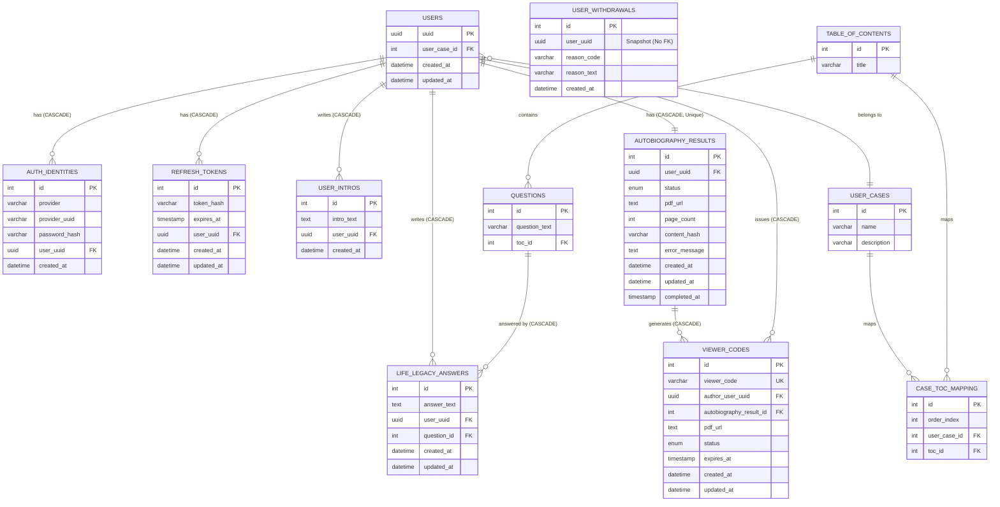

# Backend Database ERD 및 구조 명세서

본 문서는 NestJS 백엔드의 TypeORM Entity를 기반으로 작성된 실제 DB 구조 문서입니다.

## 1. Entity 목록
현재 프로젝트(`src/db/entity`)에 정의된 주요 엔티티 목록입니다.
- **User**: 사용자 (PK: `uuid`)
- **AuthIdentity**: 사용자의 로그인 수단 (이메일/비밀번호, 소셜 로그인 등)
- **RefreshToken**: JWT 리프레시 토큰 관리
- **UserIntro**: 사용자의 자기소개
- **LifeLegacyAnswer**: 질문에 대한 사용자의 답변 내용
- **AutobiographyResult**: AI 기반 자서전 PDF 생성 결과 및 상태
- **ViewerCode**: 타인에게 공유하기 위해 생성하는 6자리 뷰어 코드
- **UserWithdrawal**: 회원 탈퇴 이력 및 사유 (Hard Delete 지원을 위해 User와 외래 키 연동 해제됨)
- **UserCase**: 유저 유형/케이스
- **TableOfContent**: 자서전 목차
- **Question**: 목차별 세부 질문
- **CaseTocMapping**: 유형별 목차 구성 맵핑 테이블

---

## 2. 테이블별 상세 구조

### `users` (User)
| 컬럼명 | 타입 | PK/FK | nullable | unique | 설명 |
|---|---|---|---|---|---|
| `uuid` | uuid | PK | X | O | 사용자 고유 식별자 (자동 생성) |
| `user_case_id` | int | FK | O | X | 부여된 유저 유형의 ID (`UserCase`) |
| `created_at` | datetime | - | X | X | 가입 일시 |
| `updated_at` | datetime | - | X | X | 정보 수정 일시 |

### `auth_identities` (AuthIdentity)
| 컬럼명 | 타입 | PK/FK | nullable | unique | 설명 |
|---|---|---|---|---|---|
| `id` | int | PK | X | O | 식별자 |
| `provider` | varchar(50) | - | X | (복합) | 로그인 수단 (예: local, google) |
| `provider_uuid` | varchar(255) | - | X | (복합) | 프로바이더에서 제공한 고유키 (또는 email) |
| `password_hash` | varchar(255) | - | O | X | 비밀번호 해시 (소셜 로그인은 null 가능) |
| `user_uuid` | uuid | FK | X | X | 연동된 사용자 (`User.uuid`), CASCADE 적용 |
| `created_at` | datetime | - | X | X | 생성 일시 |
* **제약조건**: `UNIQUE(provider, provider_uuid)`

### `refresh_tokens` (RefreshToken)
| 컬럼명 | 타입 | PK/FK | nullable | unique | 설명 |
|---|---|---|---|---|---|
| `id` | int | PK | X | O | 식별자 |
| `token_hash` | varchar(255) | - | X | X | 리프레시 토큰의 해시값 |
| `expires_at` | timestamp | - | X | X | 토큰 만료 일시 |
| `user_uuid` | uuid | FK | X | X | 연동된 사용자 (`User.uuid`), CASCADE 적용 |
| `created_at` | datetime | - | X | X | 생성 일시 |
| `updated_at` | datetime | - | X | X | 수정 일시 |

### `user_intros` (UserIntro)
| 컬럼명 | 타입 | PK/FK | nullable | unique | 설명 |
|---|---|---|---|---|---|
| `id` | int | PK | X | O | 식별자 |
| `intro_text` | text | - | X | X | 자기소개 텍스트 |
| `user_uuid` | uuid | FK | X | X | 연동된 사용자 (`User.uuid`), CASCADE 적용 |
| `created_at` | datetime | - | X | X | 작성 일시 |

### `life_legacy_answers` (LifeLegacyAnswer)
| 컬럼명 | 타입 | PK/FK | nullable | unique | 설명 |
|---|---|---|---|---|---|
| `id` | int | PK | X | O | 식별자 |
| `answer_text` | text | - | X | X | 질문에 대한 답변 내용 |
| `user_uuid` | uuid | FK | X | (복합) | 작성한 사용자 (`User.uuid`), CASCADE 적용 |
| `question_id` | int | FK | X | (복합) | 연관된 질문 (`Question.id`), CASCADE 적용 |
| `created_at` | datetime | - | X | X | 최초 작성 일시 |
| `updated_at` | datetime | - | X | X | 마지막 수정 일시 |
* **제약조건**: `UNIQUE(user_uuid, question_id)` (1명의 사용자는 1개의 질문에 1개의 답만 가짐)

### `autobiography_results` (AutobiographyResult)
| 컬럼명 | 타입 | PK/FK | nullable | unique | 설명 |
|---|---|---|---|---|---|
| `id` | int | PK | X | O | 식별자 |
| `user_uuid` | uuid | FK | X | O | 작성자 (`User.uuid`), CASCADE 적용 |
| `status` | enum | - | X | X | 자서전 상태 (NOT_STARTED, PROCESSING, COMPLETED, FAILED) 기본값: NOT_STARTED |
| `pdf_url` | text | - | O | X | 최종 생성된 자서전 PDF 링크 |
| `page_count` | int | - | O | X | 전체 페이지 수 |
| `content_hash` | varchar(255) | - | O | X | 변경 감지용 내용 해시값 |
| `error_message` | text | - | O | X | 생성 실패 시 원인 |
| `created_at` | datetime | - | X | X | 시작 일시 |
| `updated_at` | datetime | - | X | X | 갱신 일시 |
| `completed_at` | timestamp | - | O | X | 생성 완료 일시 |
* **제약조건**: `UNIQUE(user_uuid)`

### `viewer_codes` (ViewerCode)
| 컬럼명 | 타입 | PK/FK | nullable | unique | 설명 |
|---|---|---|---|---|---|
| `id` | int | PK | X | O | 식별자 |
| `viewer_code` | varchar(6) | - | X | O | 6자리 공유 코드 |
| `author_user_uuid` | uuid | FK | X | X | 코드를 발급한 작성자 (`User.uuid`), CASCADE |
| `autobiography_result_id` | int | FK | X | X | 연결된 자서전 결과물 (`AutobiographyResult.id`), CASCADE |
| `pdf_url` | text | - | O | X | 뷰어에게 노출될 최종 PDF 경로 |
| `status` | enum | - | X | X | 활성 상태 (ACTIVE, EXPIRED, REVOKED) 기본값: ACTIVE |
| `expires_at` | timestamp | - | X | X | 코드 만료 일시 |
| `created_at` | datetime | - | X | X | 생성 일시 |
| `updated_at` | datetime | - | X | X | 수정 일시 |

### `user_withdrawals` (UserWithdrawal)
| 컬럼명 | 타입 | PK/FK | nullable | unique | 설명 |
|---|---|---|---|---|---|
| `id` | int | PK | X | O | 식별자 |
| `user_uuid` | uuid | - | X | X | 탈퇴한 사용자 스냅샷. FK 없음. |
| `reason_code` | varchar(32) | - | X | X | 탈퇴 사유 코드 |
| `reason_text` | varchar(255) | - | O | X | 주관식 탈퇴 사유 |
| `created_at` | datetime | - | X | X | 탈퇴 처리 일시 |

---

## 3. 관계 정리 (Relations)

- **`User`와 `AuthIdentity` (1:N)**: 사용자는 여러 로그인 수단을 가질 수 있습니다. User가 `Hard Delete`될 때 `CASCADE` 처리를 통해 함께 지워집니다.
- **`User`와 `RefreshToken` (1:N)**: 기기별 다중 로그인을 지원하여 토큰이 1:N으로 연결됩니다. (`CASCADE` 지원)
- **`User`와 `UserIntro` (1:N)**: 여러 버전의 자기소개가 있거나 갱신될 수 있습니다. (`CASCADE` 지원)
- **`User`와 `LifeLegacyAnswer` (1:N)**: 한 명의 사용자가 여러 개의 질문에 대해 답변을 남깁니다. 단, 엔티티 단의 `@Unique(['user', 'question'])` 제약으로 동일 질문에는 하나만 작성 가능합니다. (`CASCADE` 지원)
- **`User`와 `AutobiographyResult` (1:1 느낌의 1:N)**: 유저 당 자서전 PDF 처리 결과가 매핑됩니다. `@Unique(['userUuid'])`로 사실상 1:1 관계를 갖습니다. (`CASCADE` 지원)
- **`AutobiographyResult`와 `ViewerCode` (1:N)**: 완성된 하나의 자서전에 대해 여러 개의 공유 코드(뷰어 코드)를 발급할 수 있습니다. 자서전 삭제 시 코드도 `CASCADE` 지워집니다.
- **`UserWithdrawal` 구조**: 사용자가 회원 탈퇴할 시 `users` 테이블에서 레코드가 삭제(Hard Delete)됩니다. 외래 키 제약 조건 위반을 피하기 위해 `user_withdrawals` 엔티티에는 `users`로의 `@ManyToOne` FK 연동 없이 단순 `userUuid` 문자열 스냅샷만 남겨 이력을 보존합니다.

---

## 4. Mermaid ERD

---

## 5. `synchronize: false` 관련 DB 구축 정보

현재 이 프로젝트는 운영 환경 및 안정성을 위해 **TypeORM 자동 동기화를 비활성화**(`synchronize: false`)한 상태입니다.

- **설정 위치**: `src/db/db.module.ts` 내부의 `TypeOrmModule.forRootAsync` 반환 객체
- **SQL 파일 위치**: `sql/setup_final.sql`

새로운 데이터베이스 환경을 구축하거나 최근 추가된 기능을 사용하기 위해서는 기존의 엔티티 생성을 위한 마이그레이션 적용 후, `setup_final.sql`을 수동으로 실행해주어야 합니다.

### `setup_final.sql` 반영 요약:
1. **`viewer_codes` 테이블 생성**:
   TypeORM 자동 동기가 꺼진 이후 새롭게 추가된 공유 코드 관리 테이블을 생성합니다. 사용자 탈퇴와 자서전 삭제 시 모두 함께 지워지도록 `ON DELETE CASCADE`가 적용되어 있습니다.
2. **`user_withdrawals` 스키마 보정**:
   `user_uuid` 컬럼 추가를 통해 하드 딜리트 시 외래키 무결성 원칙을 깨지 않고도 어느 유저가 탈퇴했는지 기록을 남깁니다.
3. **`ON DELETE CASCADE` 외래키 재설정**:
   - `auth_identities`, `refresh_tokens`, `life_legacy_answers`, `user_intros`, `autobiography_results` 테이블의 기존 `users.uuid` 대상 외래키를 드랍(`DROP`)하고 `ON DELETE CASCADE` 옵션을 붙여 다시 추가합니다. 
   - 이를 통해 백엔드에서 사용자 계정을 완벽히 삭제(Hard Delete)할 때 연관된 데이터들이 에러 없이 일괄 삭제되도록 만듭니다.
